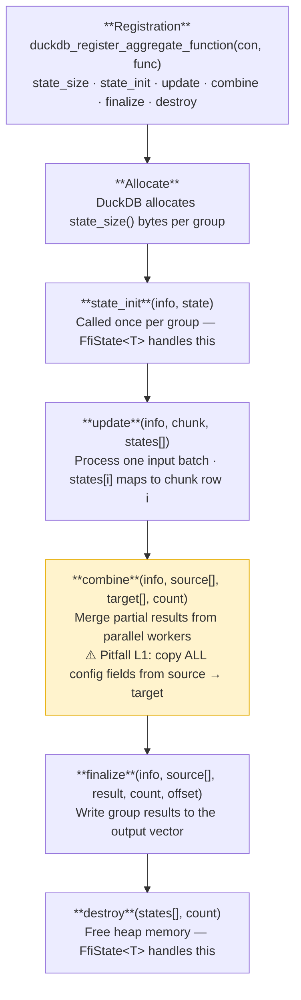

# Architecture

## Table of Contents

- [Module Overview](#module-overview)
- [Design Principles](#design-principles)
- [Dependency Model](#dependency-model)
- [Safety Model](#safety-model)
- [The loadable-extension Feature](#the-loadable-extension-feature)
- [DuckDB Aggregate Lifecycle](#duckdb-aggregate-lifecycle)
- [ADR-001: Thin Wrapper Mandate](#adr-001-thin-wrapper-mandate)
- [ADR-002: Bounded Version Range](#adr-002-bounded-version-range)
- [ADR-003: No Panics Across FFI](#adr-003-no-panics-across-ffi)

---

## Module Overview

```
quack_rs
├── entry_point      Extension initialization (init_extension / init_extension_v2, entry_point! / entry_point_v2!)
├── connection       Connection facade + Registrar trait (version-agnostic registration)
├── aggregate
│   ├── state        FfiState<T> — raw-pointer lifecycle wrapper
│   ├── callbacks    Type aliases for the 6 DuckDB aggregate callback signatures
│   ├── info         AggregateFunctionInfo — callback info wrapper
│   └── builder/
│       ├── single   AggregateFunctionBuilder (single-signature)
│       └── set      AggregateFunctionSetBuilder, OverloadBuilder
├── scalar
│   ├── info         ScalarFunctionInfo (+ ScalarBindInfo, ScalarInitInfo with `duckdb-1-5`)
│   └── builder/
│       ├── single   ScalarFn type alias, ScalarFunctionBuilder (+ varargs(), volatile(), bind(), init() with `duckdb-1-5`)
│       └── set      ScalarFunctionSetBuilder, ScalarOverloadBuilder
├── cast
│   └── builder      CastFunctionBuilder, CastFunctionInfo, CastMode
├── table
│   ├── builder      TableFunctionBuilder, BindFn/InitFn/ScanFn type aliases
│   ├── info         BindInfo, InitInfo, FunctionInfo — callback info wrappers
│   ├── bind_data    FfiBindData<T> — type-safe bind-phase data storage
│   ├── init_data    FfiInitData<T>, FfiLocalInitData<T> — scan state storage
│   └── typed        TypedTableFunctionBuilder<S> — closure-based bind/scan with typed state
├── catalog          Catalog, CatalogEntry, CatalogEntryType — catalog entry lookup (requires `duckdb-1-5`)
├── client_context   ClientContext — client context access (requires `duckdb-1-5`)
├── config_option    ConfigOptionBuilder — extension-defined configuration options (requires `duckdb-1-5`)
├── copy_function    CopyFunctionBuilder, CopyBindInfo, CopySinkInfo — custom COPY TO handlers (requires `duckdb-1-5`)
├── replacement_scan ReplacementScanBuilder — SELECT * FROM 'file.xyz' patterns
├── data_chunk       DataChunk — ergonomic wrapper for duckdb_data_chunk
├── value            Value — RAII wrapper for duckdb_value with typed extraction
├── vector
│   ├── reader       VectorReader — typed reads from duckdb_data_chunk
│   ├── writer       VectorWriter — typed writes to duckdb_vector
│   ├── validity     ValidityBitmap — NULL flag management
│   ├── string       DuckStringView — 16-byte duckdb_string_t format
│   └── complex      StructVector, ListVector, MapVector, ArrayVector
├── types
│   ├── type_id      TypeId enum — all DuckDB column types
│   ├── logical_type LogicalType — RAII for duckdb_logical_type
│   └── null_handling NullHandling — NULL propagation behaviour
├── table_description TableDescription — table metadata queries (requires `duckdb-1-5`)
├── sql_macro        SqlMacro — SQL macro registration (scalar and table macros)
├── interval         DuckInterval, interval_to_micros (checked + saturating)
├── config           DbConfig — RAII wrapper for duckdb_config
├── error            ExtensionError, ExtResult<T>
├── validate         Validation utilities for community extension compliance
├── scaffold         Project scaffolding for DuckDB Rust extensions
├── prelude          Convenience re-exports for common extension development
└── testing
    ├── harness          AggregateTestHarness<S> — pure-Rust aggregate testing
    ├── mock_vector      MockVectorReader, MockVectorWriter, MockDuckValue
    ├── mock_registrar   MockRegistrar, CastRecord — registration verification
    └── in_memory_db     InMemoryDb — bundled DuckDB for SQL-level tests (requires `bundled-test`)
```

### Module responsibilities

| Module | Responsibility | FFI |
|--------|---------------|-----|
| `entry_point` | Correct initialization sequence (`init_extension`, `init_extension_v2`) | Yes |
| `connection` | `Connection` facade + `Registrar` trait — version-agnostic registration | Yes |
| `aggregate::state` | `Box<T>` lifecycle behind a raw pointer | Yes |
| `aggregate::callbacks` | Signature documentation only (type aliases) | No |
| `aggregate::info` | `AggregateFunctionInfo` — callback info wrapper | Yes |
| `aggregate::builder::single` | `AggregateFunctionBuilder` — single-signature registration | Yes |
| `aggregate::builder::set` | `AggregateFunctionSetBuilder`, `OverloadBuilder` | Yes |
| `scalar::info` | `ScalarFunctionInfo` (+ `ScalarBindInfo`, `ScalarInitInfo` with `duckdb-1-5`) | Yes |
| `scalar::builder::single` | `ScalarFn` type alias, `ScalarFunctionBuilder` (includes `varargs()`, `volatile()`, `bind()`, `init()` methods gated behind `duckdb-1-5`) | Yes |
| `scalar::builder::set` | `ScalarFunctionSetBuilder`, `ScalarOverloadBuilder` | Yes |
| `cast::builder` | `CastFunctionBuilder`, `CastFunctionInfo`, `CastMode` | Yes |
| `table::builder` | `TableFunctionBuilder`, callback type aliases | Yes |
| `table::info` | `BindInfo`, `InitInfo`, `FunctionInfo` — callback wrappers | Yes |
| `table::bind_data` | `FfiBindData<T>` — type-safe bind-phase data storage | Yes |
| `table::init_data` | `FfiInitData<T>`, `FfiLocalInitData<T>` — scan state storage | Yes |
| `table::typed` | `TypedTableFunctionBuilder<S>` — closure-based bind/scan with typed state (panic-safe trampolines, serial scans) | Yes |
| `catalog` | `Catalog`, `CatalogEntry`, `CatalogEntryType` — catalog entry lookup (requires `duckdb-1-5`) | Yes |
| `client_context` | `ClientContext` — access to connection catalog, config options, and connection ID (requires `duckdb-1-5`) | Yes |
| `config_option` | `ConfigOptionBuilder` — register extension-defined `SET`/`RESET` configuration options (requires `duckdb-1-5`) | Yes |
| `copy_function` | `CopyFunctionBuilder`, `CopyBindInfo`, `CopySinkInfo`, `CopyGlobalInitInfo`, `CopyFinalizeInfo` — custom `COPY TO` handler registration (requires `duckdb-1-5`) | Yes |
| `table_description` | `TableDescription` — query table column count, names, and types at runtime (requires `duckdb-1-5`) | Yes |
| `replacement_scan` | `ReplacementScanBuilder` — `SELECT * FROM 'file.xyz'` registration | Yes |
| `vector::reader` | Typed reads with correct alignment and boolean semantics | Yes |
| `vector::writer` | Typed writes with NULL flag support | Yes |
| `vector::validity` | Bit-packed validity bitmap abstraction | Yes |
| `vector::string` | Inline vs. pointer string format handling | Yes |
| `vector::complex` | `StructVector`, `ListVector`, `MapVector`, `ArrayVector` — nested type access | Yes |
| `types::type_id` | Enum mapping to `DUCKDB_TYPE_*` constants | No |
| `types::logical_type` | RAII drop for `duckdb_logical_type` | Yes |
| `config` | `DbConfig` — RAII wrapper for `duckdb_config` | Yes |
| `interval` | Fixed-point microsecond arithmetic with overflow detection | No |
| `error` | `std::error::Error` + `CString` conversion | No |
| `sql_macro` | `SqlMacro` — register scalar and table SQL macros via `CREATE MACRO` | Yes |
| `validate` | Validation utilities for community extension compliance (names, SPDX, semver, etc.) | No |
| `scaffold` | Project scaffolding — generates the full file set for a DuckDB Rust extension | No |
| `prelude` | Convenience re-exports for the most commonly used items | No |
| `testing::harness` | Simulate DuckDB aggregate lifecycle in pure Rust | No |
| `testing::mock_vector` | In-memory `MockVectorReader` / `MockVectorWriter` for callback testing | No |
| `testing::mock_registrar` | `MockRegistrar` — records registrations without a DuckDB connection | No |
| `testing::in_memory_db` | `InMemoryDb` — bundled DuckDB for SQL-level tests (requires `bundled-test`) | Yes |

---

## Design Principles

### 1. Thin wrapper

Every abstraction earns its place by reducing boilerplate **or** improving safety.
When in doubt, prefer the simpler option. This crate does not aim to be a complete
DuckDB SDK — it solves the problems that are genuinely hard to get right from first
principles.

### 2. Zero panics across FFI

`unwrap()`, `expect()`, and `panic!()` are forbidden in any code path that may be
invoked by DuckDB. Panicking across a C FFI boundary is undefined behaviour. All
error handling uses `Result`/`Option` and the `?` operator. Errors are reported
back to DuckDB via `access.set_error`.

### 3. Bounded version range

`libduckdb-sys = ">=1.4.4, <2"` — the range is intentional. DuckDB's C API is
stable across the 1.4.x and 1.5.x releases (both use C API `v1.2.0`, verified by
E2E tests). The upper bound prevents silent adoption of a new major-band whose
C API may introduce breaking changes.

### 4. Testable business logic

Aggregate state structs (`T: AggregateState`) have zero FFI dependencies. The
`testing::harness::AggregateTestHarness<T>` simulates the full DuckDB aggregate
lifecycle in pure Rust, letting you test complex business logic without a live
DuckDB instance. Only the FFI glue code (callbacks, registration) requires DuckDB.

---

## Dependency Model

```
Extension crate
    ├── quack_rs (this crate)
    │       ├── libduckdb-sys = ">=1.4.4, <2" { loadable-extension }
    │       └── (no other runtime deps)
    └── libduckdb-sys = ">=1.4.4, <2" { loadable-extension }
            └── (bundled DuckDB headers only — no linked library)
```

The `duckdb-1-5` cargo feature flag gates modules that depend on DuckDB 1.5.0+
C API symbols: `catalog`, `client_context`, `config_option`, `copy_function`, and
`table_description`. It also enables `ScalarFunctionBuilder` methods `varargs()`,
`volatile()`, `bind()`, and `init()`. The feature is defined in the crate's
`Cargo.toml` and carries no extra dependencies — it only controls `#[cfg]` gates.

The `loadable-extension` feature of `libduckdb-sys` changes the linkage model:
instead of linking against `libduckdb`, the crate emits a shared library that
receives a function pointer table from DuckDB at load time. See
[The loadable-extension Feature](#the-loadable-extension-feature).

At test time, add `duckdb = { version = ">=1.4.4, <2", features = ["bundled"] }` as a
dev-dependency if you need a live DuckDB instance. Note the constraint described
in [CONTRIBUTING.md](../CONTRIBUTING.md#test-strategy).

---

## Safety Model

All `unsafe` code is isolated within this crate. Consumers using the high-level
builder API write 100% safe Rust. Internally:

- Every `unsafe` block has a `// SAFETY:` comment.
- The `#![deny(unsafe_op_in_unsafe_fn)]` lint is enabled globally: unsafe operations
  inside `unsafe fn` still require explicit `unsafe {}` blocks with their own comment.
- Raw pointer validity is enforced through type invariants:
  - `FfiState<T>::init_callback` — caller guarantees `state` points to allocated memory
  - `FfiState<T>::destroy_callback` — sets `inner = null` after freeing (prevents double-free)
  - `VectorReader::new` — caller guarantees `chunk` lives at least as long as the reader

---

## The loadable-extension Feature

When `libduckdb-sys` is compiled with `features = ["loadable-extension"]`:

1. All DuckDB C API functions (`duckdb_connect`, `duckdb_vector_get_data`, etc.) are
   replaced with thin wrappers that dispatch through a global `AtomicPtr` table.
2. The table is `null` at process start.
3. DuckDB calls `duckdb_rs_extension_api_init(info, access, version)` when loading
   the extension, which fills the table.
4. Any call before `duckdb_rs_extension_api_init` panics with
   `"DuckDB API not initialized"`.

**Consequence for tests**: you cannot call any `duckdb_*` function in a `cargo test`
process. Design your state structs and business logic to be testable without DuckDB,
then use `AggregateTestHarness` to simulate the aggregate lifecycle.

---

## DuckDB Aggregate Lifecycle

Understanding this lifecycle is essential for writing correct aggregate callbacks.



The `FfiState<T>` wrapper handles steps 2 and 6 automatically. Your callbacks
implement steps 3, 4, and 5.

### Pitfall L1: combine must propagate configuration fields

DuckDB's parallel execution model calls `state_init` on target states before
`combine`. A target state starts as `T::default()`, not a copy of the source.
This means any configuration field (e.g., `n_conditions: usize`) that was set
during `update` must be explicitly copied in `combine`:

```rust
// CORRECT: propagate all fields
unsafe extern "C" fn combine(_, source: *mut State, target: *mut State, count: idx_t) {
    for i in 0..count as usize {
        let src = &*(*source.add(i) as *const MyState);
        let tgt = &mut *(*target.add(i) as *mut MyState);
        tgt.config_field = src.config_field;  // must copy
        tgt.accumulator += src.accumulator;
    }
}
```

See `testing/harness.rs` for a test that demonstrates this bug and its fix.

---

## ADR-001: Thin Wrapper Mandate

**Context**: It is tempting to add convenience layers, ergonomic macros, or
high-level abstractions on top of the DuckDB C API.

**Decision**: This crate exposes only what is necessary to make the unsafe FFI
patterns safe and correct. It does not attempt to hide the DuckDB C API entirely.
Consumers are expected to understand DuckDB's aggregate and vector model.

**Consequences**: The crate stays small, auditable, and easy to update when the
DuckDB C API changes. Consumers who want a higher-level API can build it on top.

---

## ADR-002: Bounded Version Range

**Context**: `libduckdb-sys` follows DuckDB's version number. Between DuckDB major
releases, the C API can change in ways that silently break extensions:
- New function signatures
- Changed constant values
- Renamed symbols

**Decision**: Use `libduckdb-sys = ">=1.4.4, <2"`. The range covers DuckDB 1.4.x
and 1.5.x, whose C API (`v1.2.0`) is stable and verified by E2E tests against both
releases. The `<2` upper bound prevents silent adoption of a future major release
that may introduce breaking C API changes.

**Consequences**: Extensions must explicitly choose when to upgrade DuckDB.
The `duckdb-behavioral` experience motivating this library showed that silent
API changes cost days of debugging.

---

## ADR-003: No Panics Across FFI

**Context**: `panic!` in a `no_std`-adjacent context, or across a C FFI boundary,
is undefined behaviour. DuckDB calls extension callbacks from C++; a Rust panic
propagating into C++ unwinding is UB.

**Decision**: Every callback and entry point uses `Result`/`Option`. Errors are
reported via `access.set_error`. The `panic = "abort"` release profile setting
is a defence-in-depth measure, not a substitute for correct error handling.

**Consequences**: All callbacks are slightly more verbose, but the invariant is
enforced by the type system rather than convention.
